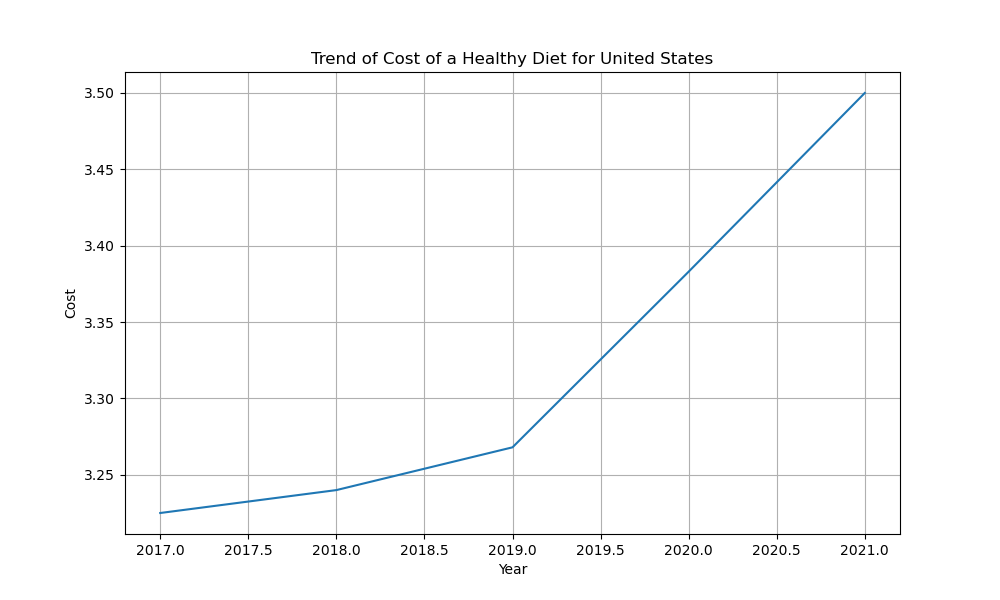
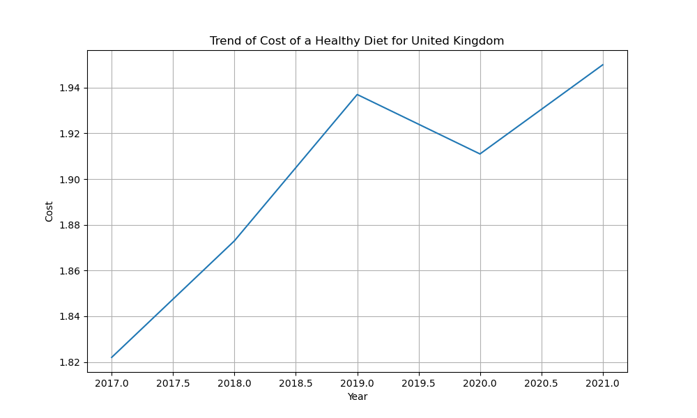
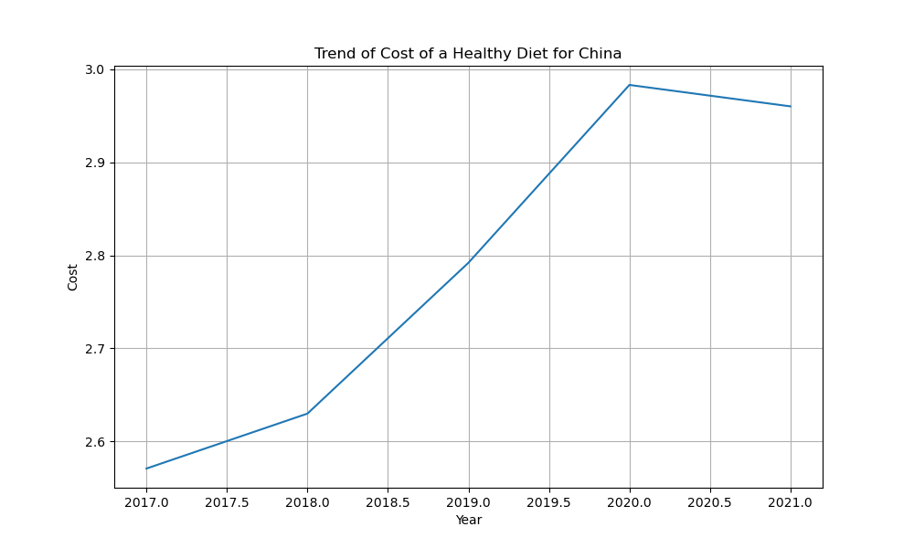
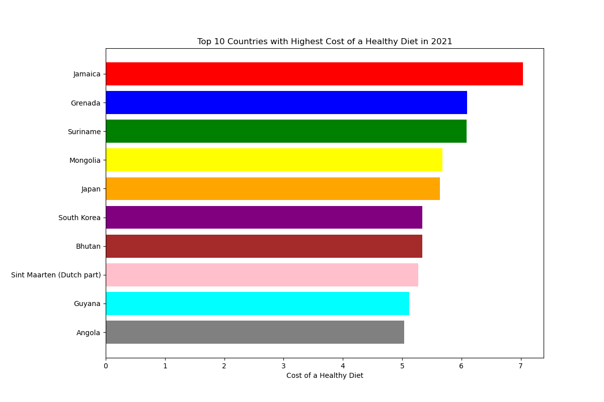

# Continuous Integration using GitHub Actions of Python Data Science

This project is a basic demonstration of using the Pandas library in Python to compute descriptive statistics from a CSV data sample. The script loads the data, computes the statistics, and prints the results to the console. 

## Prerequisites

Ensure you have the following installed:
- Python (3.x recommended)
- Python Dependencies: (pip install -r requirements.txt)

## Files

1. **Pandas_package/main.py**:
   - Contains the primary script for loading data and computing descriptive statistics.
   
2. **tests/test_main.py**:
   - Contains unit tests for the main functionality.
   
3. **data/data_sample.csv**:
   - A sample CSV data file.

## Usage

1. Clone the repository to your local machine.
2. Navigate to the directory containing the files.
3. To view the descriptive statistics, run:
```bash
python Pandas_package/main.py
```
4. To run the unit tests, run:
```bash
python -m unittest tests.test_main
```

## Results

Here are some visual results based on the analysis:









## Demo

## References
Data source: https://ourworldindata.org/explorers/food-prices?tab=chart&time=2019..2021&facet=none&country=NGA~BGD~IND~ETH~MEX~USA~BRA~GBR~CHN&Diet=Healthy+diet&Cost+or+Affordability=Cost+&Affordability+metric=Share+that+cannot+afford